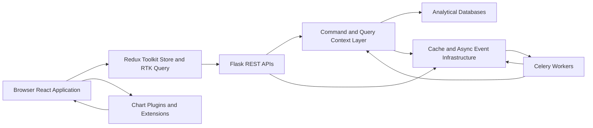
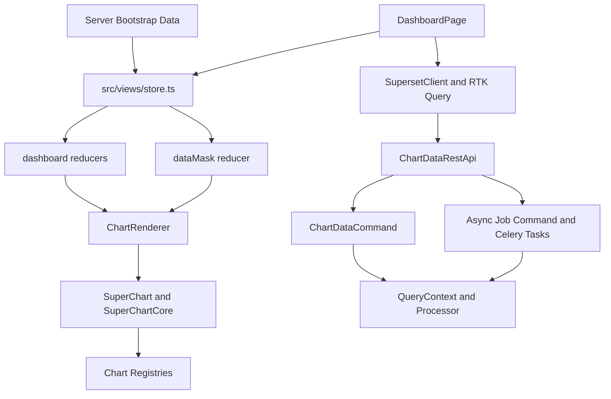
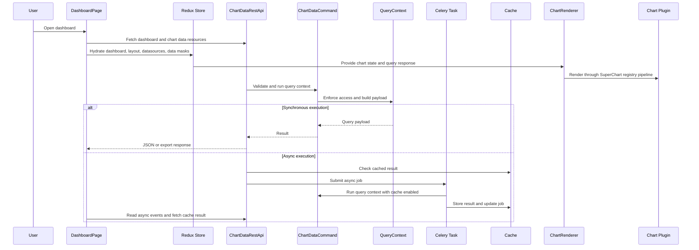

[CodeWiki](../index.md) / [Historical](../Historical/index.md) / [Architecture](index.md)

# SYSTEM ARCHITECTURE DOCUMENT

System/Programme Name: Apache Superset repository `superset-347930`  
Organisation: Apache Superset project  
Author: Kavia DocumentationAgent  
Version: 1.0  
Date: 2026-06-22  
Framework Alignment: TOGAF ADM · ISO/IEC/IEEE 42010:2011  
Confidentiality Notice: This document is generated for engineering onboarding and repository analysis. It describes implementation details observed in the local `superset-347930` codebase and should be reviewed before use as an authoritative project artifact.

## 1. Document Control

### 1.1 Version History

| Version | Date | Author | Change Summary |
| --- | --- | --- | --- |
| 1.0 | 2026-06-22 | Kavia DocumentationAgent | Initial system-level engineering architecture document based on source-code inspection of the Superset backend, frontend, plugin, async query, and API layers. |

### 1.2 Review & Approvals

| Name | Role | Signature | Date |
| --- | --- | --- | --- |
| [To be determined] | Enterprise Architect | [To be determined] | [To be determined] |
| [To be determined] | CTO | [To be determined] | [To be determined] |
| [To be determined] | Security Architect | [To be determined] | [To be determined] |
| [To be determined] | CIO | [To be determined] | [To be determined] |

### 1.3 Distribution

| Recipient | Role | Access Level |
| --- | --- | --- |
| Senior backend engineers | Backend architecture and service ownership | Internal engineering |
| Senior frontend engineers | Frontend architecture and visualization ownership | Internal engineering |
| Platform engineers | Deployment, async infrastructure, and operational ownership | Internal engineering |
| Engineering leadership | Technical strategy and roadmap governance | Internal engineering |

### 1.4 Related Documents

| Document | Reference | Version | Status |
| --- | --- | --- | --- |
| Extension Architecture | `superset-347930/docs/developer_docs/extensions/architecture.md` | Repository current | Source reference |
| Frontend Store Configuration | `superset-347930/superset-frontend/src/views/store.ts` | Repository current | Source reference |
| Chart Data REST API | `superset-347930/superset/charts/data/api.py` | Repository current | Source reference |
| Chart Plugin Model | `superset-347930/superset-frontend/packages/superset-ui-core/src/chart/models/ChartPlugin.ts` | Repository current | Source reference |
| Async Query Tasks | `superset-347930/superset/tasks/async_queries.py` | Repository current | Source reference |

## 2. Executive Summary

### 2.1 Purpose of this Document

This document defines an onboarding-grade system architecture view for the current `superset-347930` codebase. It is aligned with TOGAF ADM and ISO/IEC/IEEE 42010:2011 in the sense that it captures architectural stakeholders, concerns, viewpoints, components, runtime processes, data flow, dependencies, and improvement opportunities. The purpose is not to propose a new product architecture, but to make the existing implementation understandable to senior engineers who need to maintain, extend, or refactor the system.

### 2.2 Problem Statement

Apache Superset is a large data visualization platform with a Flask/Python backend and a React/TypeScript frontend. The inspected codebase includes thousands of files across backend APIs, command layers, query execution, frontend Redux state, RTK Query resources, dashboard and Explore modules, SQL Lab, visualization plugins, dynamic extension mechanisms, and asynchronous chart-data infrastructure. The resulting architecture is powerful but complex. Engineers joining the project must understand multiple state-management patterns, both synchronous and asynchronous request lifecycles, registry-based rendering, plugin contribution points, and cache-dependent async workflows before they can safely make changes.

### 2.3 Proposed Solution

The current architecture should be understood as a layered system. The frontend initializes a Redux Toolkit store with classic Redux reducers, thunk middleware, listener middleware, logging middleware, and an RTK Query API slice. Dashboard pages hydrate store state from backend resources, derive active filters and data masks, and render dashboard grids that eventually delegate individual chart rendering to `ChartRenderer`, `SuperChart`, and `SuperChartCore`. The chart core resolves visualization implementations through singleton registries populated by chart plugins and presets. The backend exposes Flask-AppBuilder REST APIs that validate query contexts, authorize access through command objects and query context processors, execute queries synchronously when possible, or submit cache-backed Celery jobs when global async queries are enabled. Async job completion is communicated through an async event API backed by the async query manager.

### 2.4 Strategic Benefits

| Benefit | Description | Measurable Outcome | Stakeholder |
| --- | --- | --- | --- |
| Faster onboarding | Senior engineers receive a single map of state, APIs, rendering, plugins, and async flows. | Reduced time to first architecture-level change. | Engineering managers and technical leads |
| Safer refactoring | Coupling points and bottlenecks are explicitly identified. | Refactors can be scoped around known seams such as store slices, query commands, and registries. | Senior engineers |
| Better scalability planning | Cache dependency, Redux-state growth, and plugin loading concerns are documented. | Performance and reliability work can be prioritized against known runtime hotspots. | Platform and product engineering |
| Improved architectural governance | Module responsibilities and dependency relationships are stated in one document. | Future changes can be reviewed against explicit architectural boundaries. | Architecture reviewers |

## 3. Architecture Framework & Standards

### 3.1 Architecture Framework

| Attribute | Detail |
| --- | --- |
| Framework Adopted | TOGAF ADM-inspired documentation structure with implementation-grounded source analysis. |
| ADM Phases | Architecture Vision, Information Systems Architecture, Technology Architecture, Opportunities and Solutions, and Governance are represented through the sections in this document. |
| Repository | `superset-347930` under `/home/kavia/workspace/code-generation`. |
| Modelling Language | Markdown narrative, Mermaid diagrams, and component/dependency tables. |
| Diagram Tool | Mermaid diagrams embedded in Markdown. |

### 3.2 Standards Compliance Register

| Standard / Regulation | Domain | Applicability | Compliance Owner |
| --- | --- | --- | --- |
| ISO/IEC/IEEE 42010:2011 | Architecture documentation | This document identifies stakeholders, concerns, views, and architecture elements. | Architecture reviewer |
| TOGAF ADM | Enterprise architecture process | The structure follows architecture-document conventions rather than a full ADM engagement. | Enterprise architect |
| Apache Superset security model | Authorization and threat model | API routes and data-bearing resources must respect the repository’s security model. | Security architect |
| Flask-AppBuilder route protection | Backend access control | REST APIs use decorators such as `@protect()` and command/query validation. | Backend engineering |
| TypeScript and Redux Toolkit conventions | Frontend maintainability | Store, hooks, reducers, and RTK Query slices should maintain type-safety and predictable state updates. | Frontend engineering |

### 3.3 Architecture Principles

| Principle | Statement | Implication / Trade-off |
| --- | --- | --- |
| Layered responsibility | API routes, commands, query contexts, reducers, and renderers each own distinct concerns. | Cross-layer shortcuts should be avoided, but legacy flows may already span multiple modules. |
| Registry-based visualization | Chart implementations are discovered through registries populated by plugins and presets. | Adding visualization types is extensible, but runtime resolution depends on correct registration keys and loader behavior. |
| Cache-aware async execution | Async chart data relies on cache keys and result URLs rather than directly streaming completed payloads through the initial request. | This improves responsiveness for long-running queries but increases dependency on cache and async event infrastructure. |
| Bootstrap plus hydration | Frontend state begins with server-provided bootstrap data and is later hydrated by resource APIs. | Initial render paths are fast, but state ownership can be split between bootstrapped data, fetched data, local storage, and Redux. |
| Extension through explicit APIs | Frontend and backend extensions use documented contribution points and shared core packages. | Extension stability depends on versioned APIs, module federation setup, and clear host-extension boundaries. |

## 4. Scope & Boundaries

### 4.1 In Scope

This document covers the current implementation architecture of the Superset application code visible in `superset-347930`. It includes the React/TypeScript frontend store, dashboard hydration, data-mask management, chart rendering pipeline, chart plugin registries, frontend API clients, backend chart-data APIs, command objects, query context execution, asynchronous query submission and completion, extension architecture documentation, and major dependency relationships among these modules.

### 4.2 Out of Scope

This document does not provide a full deployment runbook, database schema reference, every REST API endpoint, every visualization plugin, every SQL Lab action, or every Flask-AppBuilder view. It also does not propose code changes or modify source files. It focuses on system-level architecture, data flow, and senior-engineer onboarding concerns.

### 4.3 Assumptions

| ID | Assumption | Impact if Wrong |
| --- | --- | --- |
| A-001 | The inspected files represent the current target branch for analysis. | Architectural conclusions may be stale if another branch contains major refactors. |
| A-002 | The CodeWiki document should describe current state rather than a proposed future architecture. | Forward-looking recommendations could be misplaced if the intended artifact was a future-state specification. |
| A-003 | The chart-data path is the primary representative end-to-end data flow for Superset rendering. | Other flows such as SQL Lab query editing, report scheduling, or import/export may require separate deep dives. |

### 4.4 Constraints

| ID | Constraint | Source | Impact |
| --- | --- | --- | --- |
| C-001 | Documentation must remain grounded in existing source files. | DocumentationAgent task instructions | Findings are limited to observed implementation details. |
| C-002 | New published documentation must be under `kavia-docs/CodeWiki/` and indexed. | CodeWiki navigation guidance | The document is placed under `CodeWiki/Architecture` and linked from indexes. |
| C-003 | No source-code files may be changed. | DocumentationAgent task instructions | Recommendations are documented but not implemented. |

## 5. Business Context & Drivers

### 5.1 Strategic Drivers

Superset’s architecture is driven by the need to support interactive business intelligence workflows over diverse data sources. The platform must support dashboard consumption, chart exploration, SQL query workflows, embedded analytics, extensible visualization plugins, and large data exports. From an engineering standpoint, the most important drivers are extensibility, query performance, authorization correctness, frontend responsiveness, and maintainability across a large multi-module repository.

### 5.2 Business Capabilities

| Capability ID | Capability Name | Description | Priority |
| --- | --- | --- | --- |
| CAP-001 | Dashboard consumption | Users view dashboards composed of chart slices, layout components, filters, and custom styling. | High |
| CAP-002 | Interactive chart rendering | Users render visualizations through registered plugins and chart metadata. | High |
| CAP-003 | Explore query execution | Users construct query contexts in the frontend and request chart data from backend APIs. | High |
| CAP-004 | Async chart data execution | Long-running JSON chart requests can be submitted as background jobs and retrieved from cache. | High |
| CAP-005 | Plugin and extension development | Developers add visualization types and runtime extensions using registry and extension APIs. | Medium |
| CAP-006 | Export and reporting support | Backend responses support JSON, CSV, Excel, ZIP, and streaming CSV behavior for chart data. | Medium |

### 5.3 Stakeholders

| Stakeholder | Role | Architecture Concern | Engagement Level |
| --- | --- | --- | --- |
| Frontend engineer | Maintains dashboard, Explore, SQL Lab, and visualization UI | State boundaries, rendering performance, typed hooks, plugin contracts | High |
| Backend engineer | Maintains Flask APIs, command layer, query execution, and authorization | API validation, query context processing, cache behavior, async job safety | High |
| Visualization/plugin engineer | Adds chart types and transformation logic | Plugin registration, metadata behavior, transform props, lazy loading | High |
| Platform engineer | Operates cache, Celery, async event infrastructure, and deployments | Async reliability, cache availability, worker timeouts, result delivery | Medium |
| Security engineer | Reviews authorization and data exposure | Route protection, query context access checks, guest-user data handling | High |

## 6. Non-Functional Requirements

### 6.1 Quality Attribute Summary

| NFR ID | Quality Attribute (ISO 25010) | Requirement | Target | Acceptance Test |
| --- | --- | --- | --- | --- |
| NFR-001 | Performance efficiency | Dashboard rendering must avoid unnecessary chart re-renders and excessive payload cloning. | Chart render time remains bounded for typical dashboards. | Measure render timings logged through chart render events. |
| NFR-002 | Reliability | Async chart jobs must complete, publish status, and expose a result URL or errors. | Jobs reach `done` or `error` state and clients can retrieve status. | Exercise `GLOBAL_ASYNC_QUERIES` with successful and failing chart requests. |
| NFR-003 | Security | Data-bearing chart requests must validate access before execution. | Query contexts call access checks before payload retrieval. | Verify `ChartDataCommand.validate()` invokes `QueryContext.raise_for_access()`. |
| NFR-004 | Maintainability | State slices should have clear ownership and type-safe access patterns. | New frontend code uses typed dispatch and selectors where possible. | Review store usage and typed hook adoption. |
| NFR-005 | Extensibility | New chart types should register through plugin registries without modifying the chart renderer. | Plugin classes can register metadata, component loaders, controls, transforms, and build-query logic. | Add or inspect a chart plugin registration through `ChartPlugin.register()`. |
| NFR-006 | Scalability | Large CSV exports should avoid materializing impractically large response payloads. | Streaming CSV is used above configured row thresholds. | Exercise CSV export with row count above `CSV_STREAMING_ROW_THRESHOLD`. |

## 7. Current State Architecture (As-Is)

### 7.1 As-Is Overview

The current architecture is a multi-layer Superset system. The backend is a Flask-AppBuilder application organized into REST APIs, command objects, DAOs, schema validation, query context processing, cache services, Celery tasks, and extension services. The frontend is a React/TypeScript application organized into feature areas such as dashboard, Explore, SQL Lab, components, hooks, data masks, and plugin packages. State management is centered on a Redux Toolkit store that includes legacy reducers, thunk middleware, listener middleware, RTK Query middleware, logging middleware, and a SQL Lab persistence enhancer.

The visualization runtime is deliberately decoupled from individual chart implementations. Dashboard or Explore components pass chart state and query responses into `ChartRenderer`. `ChartRenderer` composes hooks and rendering metadata, protects Redux state by deep-cloning query responses for plugin consumption, and delegates visualization rendering to `SuperChart`. `SuperChart` computes dimensions, constructs chart props, handles no-result and error-boundary behavior, and delegates to `SuperChartCore`. `SuperChartCore` resolves the registered chart component and transform function from singleton registries and lazy-loads them through a loadable renderer.

### 7.2 Current State Pain Points

| ID | Pain Point | Business Impact | Root Cause |
| --- | --- | --- | --- |
| P-001 | Shared `datasources` reducer combines dashboard and Explore actions. | Changes to datasource state can affect multiple product areas and raise regression risk. | `store.ts` explicitly combines dashboard and Explore datasource reducers with a TODO calling for a larger refactor. |
| P-002 | Chart rendering deep-clones query responses before plugin render. | Large query responses can increase memory use and render latency. | `ChartRenderer.tsx` clones query responses to protect Redux state from plugin mutation. |
| P-003 | Async chart execution depends on cache availability and cache-key retrieval. | Cache failure or eviction can turn completed work into failed retrievals. | Async jobs store results in cache and return result URLs based on cache keys. |
| P-004 | Dashboard state is distributed across API results, Redux slices, data masks, local storage, and URL/permalink state. | Debugging hydration and filter behavior can be difficult. | `DashboardPage.tsx`, `dataMask/reducer.ts`, and `SyncDashboardState` participate in state composition. |
| P-005 | Visualization registry behavior depends on runtime registration ordering and keys. | Missing or duplicated keys can cause chart load failures or unexpected overwrite warnings. | `ChartPlugin.register()` writes metadata, component, control-panel, transform, and build-query loaders into singleton registries. |
| P-006 | Legacy and modern frontend state patterns coexist. | New engineers must understand Redux Toolkit, classic reducers, thunk, typed hooks, RTK Query, local storage enhancers, and feature-specific state. | Incremental migration and large historical codebase. |

### 7.3 Capability Gap Analysis

| Capability | As-Is Maturity | Target Maturity | Gap Severity | Architectural Response |
| --- | --- | --- | --- | --- |
| Frontend state ownership | Mixed legacy and modern patterns | Clearly bounded feature slices with typed state contracts | Medium | Continue Redux Toolkit migration and reduce cross-feature reducer coupling. |
| Chart rendering isolation | Strong plugin abstraction but defensive cloning remains | Plugin contracts that prevent mutation without deep cloning large payloads | Medium | Enforce immutable plugin inputs and progressively remove clone-heavy paths. |
| Async query reliability | Functional cache-backed job lifecycle | Observable, resilient, cache-aware async execution with clear failure modes | High | Improve async observability, cache TTL governance, and client recovery paths. |
| Extension architecture | Documented core package and module-federation design | Stable contribution APIs with compatibility testing | Medium | Maintain versioned extension APIs and add integration tests around extension loading. |
| API communication | Centralized `SupersetClient`, `makeApi`, and RTK Query base query | Consistent API wrappers and cancellation behavior across feature modules | Medium | Prefer RTK Query or typed API factories for new resources. |

## 8. Target State Architecture (To-Be)

### 8.1 Architecture Vision

For onboarding and maintainability, the desired architectural direction is not a rewrite but a clearer set of module boundaries. Frontend state should progressively move toward typed, feature-owned slices and RTK Query resource boundaries. Chart rendering should retain the registry and plugin abstraction while reducing defensive data copying and clarifying plugin immutability requirements. Backend chart-data execution should preserve command-based validation and query context processing while strengthening observability, cache governance, and async failure recovery. Extension APIs should remain stable and explicit, with the host application owning runtime loading and shared dependency boundaries.

### 8.2 Formal Architecture Viewpoints

| Viewpoint | Stakeholders | Concerns |
| --- | --- | --- |
| Context | Engineering leads, platform engineers | How frontend, backend, cache, workers, databases, and extensions interact. |
| Logical | Frontend and backend engineers | Store slices, APIs, commands, query contexts, renderers, registries, plugins. |
| Process | Senior engineers and SREs | Request lifecycle, async job lifecycle, chart render lifecycle, hydration sequence. |
| Data | Data platform engineers | Query context, form data, data masks, query results, cache keys, chart props. |
| Deployment | Platform engineers | Flask app, Celery workers, Redis/cache, metadata database, frontend bundles. |
| Operational | SREs and maintainers | Metrics, logging, async errors, render failures, cache behavior, export streaming. |

### 8.3 Context View (Level 1)

At the system boundary, Superset presents a browser-based frontend that communicates with Flask-AppBuilder REST APIs. The backend uses a metadata database for saved charts, dashboards, users, and configuration; data-source connections for analytical queries; cache infrastructure for query results and async payloads; Celery workers for background work; and async event streams for job-status delivery. Extensions and chart plugins integrate through frontend and backend contribution mechanisms.

### 8.3.1 Actors & External Systems

| Actor / System | Type | Interaction | Protocol / Channel |
| --- | --- | --- | --- |
| End user | Human actor | Views dashboards, explores charts, runs queries, exports data | Browser UI |
| React frontend | Application container | Fetches resources, stores UI state, renders dashboards and charts | HTTP, Redux, RTK Query |
| Flask backend | Application container | Validates requests, enforces access, executes query contexts | HTTP REST |
| Celery worker | Background worker | Executes async chart and Explore jobs | Broker and task queue |
| Cache backend | Infrastructure | Stores query results, async payloads, and event data | Cache API, Redis-like event stream |
| Analytical databases | External data systems | Execute SQL or datasource-specific queries | Database connectors |
| Extensions | Runtime contributions | Register frontend views, commands, menus, and backend APIs | Module Federation and backend extension APIs |

### 8.4 Logical View (Level 2)

The logical architecture separates presentation, state, communication, backend service orchestration, query execution, and extension registration. The boundaries are clear in concept but sometimes blurred in implementation because legacy Redux, local storage persistence, server bootstrapping, feature-specific reducers, and newer RTK Query patterns coexist.

### 8.4.1 Logical Components

| Component | Responsibility | Exposes | Consumes |
| --- | --- | --- | --- |
| `src/views/store.ts` | Configures Redux store, middleware, reducers, RTK Query reducer, and SQL Lab persistence enhancer. | `setupStore`, `store`, typed hooks, `RootState`, `AppDispatch`. | Bootstrap data, reducers, middleware, RTK Query API slice. |
| Dashboard page and containers | Fetch dashboard resources, hydrate state, apply URL/permalink filters, render dashboard container. | `DashboardPage` and connected dashboard containers. | `useDashboard`, `useDashboardCharts`, `useDashboardDatasets`, Redux dispatch/selectors. |
| Dashboard reducers | Maintain dashboard metadata, layout, filters, native filters, chart states, refresh state, and undoable layout state. | Redux state slices and action handlers. | Hydration actions, layout actions, refresh actions, filter actions. |
| Data mask reducer | Maintains filter and chart customization data masks for dashboard and Explore contexts. | Data mask state keyed by filter or customization ID. | Dashboard metadata, native filter configuration, Explore hydration. |
| Chart container and renderer | Bridges Redux actions to chart rendering and composes rendering hooks, status handling, context menus, and logging. | `ChartRenderer` with `SuperChart` props and hooks. | Chart state, query responses, data masks, plugin metadata. |
| `SuperChart` | Handles responsive dimensions, no-results behavior, matrixify behavior, chart props creation, and error boundaries. | Rendered chart wrapper. | Chart props config, theme, query data, metadata registry. |
| `SuperChartCore` | Loads chart component and transform props from registries and renders the chart implementation. | Lazy-loaded chart renderer. | Component and transform registries. |
| Chart plugin model | Registers chart metadata, build-query loader, component loader, control panel, and transform props. | `ChartPlugin.register()` and `unregister()`. | Singleton registries and plugin configuration. |
| `SupersetClientClass` | Provides authenticated HTTP request wrapper with CSRF, guest token, retry options, and unauthorized handling. | `get`, `post`, `put`, `delete`, `request`, `getCSRFToken`. | `callApiAndParseWithTimeout`, browser environment. |
| `makeApi` | Creates typed API functions with payload encoding and response processing. | API caller functions with endpoint metadata. | `SupersetClient` and error handling. |
| RTK Query API slice | Provides a shared base query around `SupersetClient` and tag types for resource hooks. | `api` reducer and middleware. | `SupersetClient`, Rison encoding, Redux Toolkit Query. |
| `ChartDataRestApi` | Handles chart-data REST endpoints for saved chart data, client-constructed query contexts, cache retrieval, export formats, and async submission. | `/api/v1/chart/{id}/data/`, `/api/v1/chart/data`, `/api/v1/chart/data/{cache_key}`. | Schemas, commands, security manager, event logger, cache loader. |
| `ChartDataCommand` | Validates access and runs query context payload generation. | `run()` and `validate()`. | `QueryContext`. |
| `QueryContext` | Represents datasource, query objects, form data, result type, result format, cache settings, and processor delegation. | Payload, cache timeout, access check, query-result methods. | `QueryContextProcessor`, datasource, query objects. |
| Async query tasks | Execute chart or Explore jobs under the correct user context and update async job status. | Celery tasks `load_chart_data_into_cache` and `load_explore_json_into_cache`. | `async_query_manager`, cache manager, security manager, query context schemas. |
| Extension system | Provides runtime extension loading and shared core APIs. | Frontend and backend contribution points. | Module Federation, `@apache-superset/core`, `apache-superset-core`, host APIs. |

### 8.4.2 Business Capability Traceability

| Business Capability (Ref) | Architectural Component(s) | Notes |
| --- | --- | --- |
| CAP-001 Dashboard consumption | Dashboard page, dashboard reducers, data mask reducer, dashboard layout reducer | Dashboard hydration combines API data, URL/permalink state, filter state, and layout. |
| CAP-002 Interactive chart rendering | ChartRenderer, SuperChart, SuperChartCore, chart registries, chart plugins | Rendering is registry-driven and supports plugin-defined behavior such as drill-to-detail. |
| CAP-003 Explore query execution | API client, chart data API, query context, ChartDataCommand | Explore constructs query contexts that backend validates and executes. |
| CAP-004 Async chart data execution | ChartDataRestApi, CreateAsyncChartDataJobCommand, Celery tasks, AsyncEventsRestApi | Async depends on cache-backed result retrieval and event stream status. |
| CAP-005 Plugin and extension development | ChartPlugin, presets, extension architecture, Module Federation | Visualization plugins and broader extensions use explicit contribution mechanisms. |
| CAP-006 Export and reporting support | ChartDataRestApi, StreamingCSVExportCommand, response helpers | Backend chooses JSON, CSV, Excel, ZIP, or streaming CSV responses. |

### 8.5 Process / Behaviour View

The most important runtime behavior is the chart-data-to-rendering flow. A dashboard page fetches dashboard, chart, and dataset resources, hydrates Redux, computes active filters and relevant data masks, and renders dashboard grid components. Chart components request or receive query data, then `ChartRenderer` passes the current form data, query responses, filter hooks, theme, dimensions, and behavior flags to `SuperChart`. `SuperChartCore` obtains the chart implementation and transform function from registries, applies pre-transform, plugin transform, and post-transform functions, and renders the chart component.

For backend chart data, `ChartDataRestApi` accepts either a saved chart ID or a client-constructed query context. It loads and validates the request through `ChartDataQueryContextSchema`, constructs `ChartDataCommand`, and calls `validate()` so the query context can enforce access. If async execution is not selected, the command runs synchronously and returns a formatted response. If async execution is selected, the API first checks cache when allowed, then submits a job through `CreateAsyncChartDataJobCommand`. The Celery task executes the same command pathway, caches results, and updates job status with a result URL. The frontend can read events through `AsyncEventsRestApi` and retrieve completed data from the cache endpoint.

### 8.6 Data View

The principal data objects flowing through the architecture are bootstrap data, Redux state slices, dashboard metadata, data masks, query form data, query contexts, query results, chart props, plugin metadata, cache keys, and async job events. Data begins either as server-rendered bootstrap state or API responses, becomes normalized or semi-normalized Redux state, is transformed into query contexts for backend execution, and returns as query data consumed by chart plugins.

### 8.6.1 Data Domains

| Domain | Owner | Classification | Primary Store |
| --- | --- | --- | --- |
| Dashboard metadata and layout | Dashboard backend and frontend dashboard module | Application metadata | Metadata database and Redux state |
| Chart form data and query context | Explore/chart backend and frontend chart modules | Application metadata and query instructions | Metadata database, request payloads, cache |
| Data masks and filter state | Dashboard native filters and dataMask reducer | User interaction state | Redux state, URL/permalink state, local storage |
| Query results | Query context processor and chart data API | Potentially sensitive analytical data | Cache and API responses |
| Async job events | Async query manager | Operational status data | Async event stream/cache |
| Plugin metadata and loaders | Visualization plugin packages | Application extension metadata | Frontend registries |

### 8.6.2 Data Governance

| Concern | Approach |
| --- | --- |
| Authorization | `ChartDataCommand.validate()` delegates to `QueryContext.raise_for_access()` before payload execution. REST APIs use route-level protection such as `@protect()`. |
| Guest-user data exposure | `ChartDataRestApi._send_chart_response()` removes query text from JSON query payloads for guest users. |
| Cache dependency | Query result and async retrieval flows depend on cache keys and configured cache timeouts. |
| Mutation control | `ChartRenderer` deep-clones query responses before rendering to reduce the risk of plugin mutation of Redux state. |
| URL and permalink state | Dashboard filters can be read from URL parameters, permalink keys, native filter keys, and old Rison filter forms before hydration. |
| Export controls | CSV and Excel export paths check permissions before returning table-like result formats. |

### 8.7 Deployment / Physical View

The inspected repository supports a typical Superset deployment consisting of a Flask web application, frontend bundles, metadata database, cache backend, Celery workers, broker infrastructure, and analytical database connections. The repository also includes Docker, Helm, websocket, embedded SDK, extension CLI, and documentation directories, but this document focuses on the application architecture rather than deployment templates.

### 8.7.1 Infrastructure Summary

| Concern | Detail |
| --- | --- |
| Web application | Flask-AppBuilder backend serving REST APIs and application pages. |
| Frontend bundles | React/TypeScript application under `superset-frontend`, including packages and plugins. |
| Metadata persistence | Superset models and saved chart/dashboard/query metadata are stored in the metadata database. |
| Cache | Query payloads, async result retrieval, and cache-key based flows depend on cache infrastructure. |
| Background work | Celery tasks execute async chart data and Explore JSON jobs. |
| Eventing | Async events are read through `AsyncEventsRestApi` using async query manager channel IDs. |
| External data | Query contexts execute against configured analytical databases and datasource abstractions. |

### 8.7.2 Environment Strategy

| Environment | Purpose | Key Differences from Production | Access Control |
| --- | --- | --- | --- |
| Local development | Feature development, debugging, and plugin iteration | Debug tooling and development bundles are commonly enabled. | Developer-controlled credentials and local configuration. |
| CI | Automated tests, linting, and quality gates | Non-interactive execution, ephemeral services. | CI service principals and repository secrets. |
| Staging | Integration validation before production | Production-like services with restricted datasets. | Limited engineering and QA access. |
| Production | End-user analytics workload | Hardened configuration, production cache, workers, metadata database, and datasource connections. | Role-based user access and operator-controlled infrastructure. |

### 8.8 Operational View

| Concern | Detail |
| --- | --- |
| SLOs | [To be determined]. The code exposes metrics hooks and event logging, but explicit SLOs were not identified in the inspected files. |
| SLIs | Candidate indicators include chart query latency, chart render duration, async job completion rate, async error rate, cache hit rate, API error rate, and export latency. |
| Alerting Policy | [To be determined]. Async job errors, cache failures, worker timeouts, and elevated API 5xx rates should be alert candidates. |
| Logging | Chart rendering logs `LOG_ACTIONS_RENDER_CHART`; backend APIs use event logger contexts and StatsD metrics decorators. |
| Error Handling | Frontend chart rendering uses error boundaries and render-failure callbacks. Backend chart data APIs map validation, cache, and query failures to HTTP responses. |
| Resilience | Async jobs catch timeout and exception cases, update job status on errors, and re-raise exceptions for worker-level visibility. |
| Operational Risk | Cache dependency is central to async query retrieval; cache TTL, eviction, and serialization behavior are operationally significant. |

## 9. Technology Stack

### 9.1 Approved Technologies

| Layer | Technology | Version | Standard / Spec | Rationale |
| --- | --- | --- | --- | --- |
| Backend web | Python and Flask-AppBuilder | Repository-defined | Flask-AppBuilder REST API conventions | Provides Superset API and security framework. |
| Backend service pattern | Command objects and query contexts | Repository-defined | Superset command pattern | Separates route handling from validation and execution. |
| Background work | Celery | Repository-defined | Celery task model | Supports async chart and Explore execution. |
| Frontend framework | React and TypeScript | Repository-defined | React component model and TypeScript types | Supports complex interactive UI and plugin rendering. |
| Frontend state | Redux Toolkit, Redux, redux-thunk, RTK Query | Repository-defined | Redux state management | Provides shared state, middleware, async thunks, and API cache slices. |
| Visualization core | `@superset-ui/core` registries and chart components | Repository-defined | Superset visualization plugin architecture | Decouples chart types from rendering container. |
| Extension loading | Webpack Module Federation | Repository-defined | Module Federation | Enables runtime loading of independently built frontend extensions. |
| Payload encoding | JSON and Rison | Repository-defined | API request conventions | Supports REST request bodies and query parameter encoding. |
| Styling and UI | Superset UI components and theme packages | Repository-defined | Superset frontend conventions | Provides consistent design system and theming. |

### 9.2 Technology Decisions Pending

| Decision | Options Under Review | Decision Criteria | Target Date |
| --- | --- | --- | --- |
| Frontend state convergence | Continue hybrid Redux approach, migrate more slices to Redux Toolkit, or increase RTK Query usage | Type safety, testability, migration cost, runtime performance | [To be determined] |
| Plugin immutability enforcement | Defensive cloning, static linting/contracts, runtime freezing in development, or plugin API revisions | Render performance, plugin compatibility, safety | [To be determined] |
| Async result durability | Cache-only result retrieval, durable job-result store, or configurable hybrid | Reliability, cost, operational complexity | [To be determined] |
| Extension compatibility testing | Manual validation, generated compatibility matrix, or automated host-extension test harness | Ecosystem stability and release confidence | [To be determined] |

## 10. Cross-Cutting Concerns

### 10.1 Security Architecture

| Control Domain | Approach / Standard |
| --- | --- |
| Route-level access | REST API routes use Flask-AppBuilder protection decorators such as `@protect()`. |
| Object/data access | Chart data execution calls `ChartDataCommand.validate()`, which invokes `QueryContext.raise_for_access()`. |
| CSRF | `SupersetClientClass` obtains and attaches `X-CSRFToken` for authenticated requests. |
| Guest access | Guest tokens can be attached to frontend requests, and guest JSON responses remove query text. |
| Export permissions | Table-like result formats check export-related permissions before returning CSV or Excel data. |
| Filename safety | Export filenames are sanitized with `secure_filename()` before use in content-disposition headers. |

### 10.2 Observability

| Pillar | Standard | Tooling | Coverage / SLO |
| --- | --- | --- | --- |
| Metrics | StatsD-style API metrics | `@statsd_metrics` decorators on backend APIs | API-level coverage exists for inspected chart and async event APIs. |
| Logging | Event logging and frontend render logging | `event_logger`, `Logger`, `LOG_ACTIONS_RENDER_CHART` | Chart render duration and backend API contexts are logged. |
| Tracing | [To be determined] | [To be determined] | No explicit distributed tracing was identified in inspected files. |
| Error reporting | Structured frontend and backend error handling | Error boundaries, command exceptions, async job status updates | Render failures, validation failures, cache failures, and async job failures are represented. |

### 10.3 Resilience Patterns

| Pattern | Application | Configuration |
| --- | --- | --- |
| Async job offload | Long-running chart JSON requests can be submitted as background jobs. | `GLOBAL_ASYNC_QUERIES`, async query manager, Celery. |
| Cache-as-result-store | Async tasks cache result payloads and publish result URLs. | Cache backend and cache timeout settings. |
| Soft time limits | Celery async query tasks use soft time limits. | `SQLLAB_ASYNC_TIME_LIMIT_SEC` is used as the inspected task timeout. |
| Error boundary | `SuperChart` wraps chart rendering in error boundaries unless disabled. | `disableErrorBoundary` prop. |
| Streaming response | Large CSV exports can stream chunks instead of returning a single materialized payload. | `CSV_STREAMING_ROW_THRESHOLD`, CSV export encoding. |
| Unauthorized redirect | Frontend API client redirects to login on 401 unless ignored. | `SupersetClientClass` unauthorized handler. |

### 10.4 Data Management

| Concern | Policy |
| --- | --- |
| Query context validation | Form data is loaded through `ChartDataQueryContextSchema` before command execution. |
| Cache timeout selection | `QueryContext.get_cache_timeout()` checks custom timeout, chart timeout, then datasource timeout. |
| Dashboard filter application | Saved chart query contexts can be modified with dashboard filter context when `filters_dashboard_id` is provided. |
| Client processing | Post-processed chart data can be transformed server-side for export consistency. |
| Response formatting | Chart data API supports JSON, CSV, Excel, ZIP, and streaming CSV behaviors based on result format and query count. |

## 11. Architecture Decision Records (ADRs)

ADR status values should be one of Proposed, Under Review, Accepted, Superseded, or Deprecated. The following records are expressed as observed decisions in the current architecture rather than newly approved governance decisions.

### ADR-001

| Field | Detail |
| --- | --- |
| ID / Status | ADR-001 / Accepted in current implementation |
| Date | [To be determined] |
| Decision Makers | Superset maintainers |
| Review Date | [To be determined] |
| Context | Superset needs to support many independently implemented visualization types. |
| Decision | Use chart plugin classes and singleton registries for chart metadata, components, control panels, transform props, and build-query functions. |
| Alternatives Considered | Direct imports in render components, server-driven chart type resolution, or static switch statements. |
| Rationale | Registry-based resolution allows plugins and presets to register visualization behavior without modifying the core renderer. |
| Positive Consequences | Extensibility, lazy loading, plugin isolation, and consistent rendering pipeline. |
| Negative Consequences / Trade-offs | Runtime key registration and loader failures can be harder to debug than static imports. |
| Compliance Impact | Plugin authors must follow registry and metadata conventions. |

### ADR-002

| Field | Detail |
| --- | --- |
| ID / Status | ADR-002 / Accepted in current implementation |
| Date | [To be determined] |
| Decision Makers | Superset maintainers |
| Review Date | [To be determined] |
| Context | Chart data queries can be slow and should not always block HTTP request completion. |
| Decision | Support cache-backed asynchronous chart data jobs using async query manager, Celery tasks, and result URLs. |
| Alternatives Considered | Always synchronous execution, websocket-only execution, or durable database-backed result storage. |
| Rationale | Cache-backed async jobs improve responsiveness and reuse existing query result caching. |
| Positive Consequences | Long-running JSON chart requests can return `202` and complete in the background. |
| Negative Consequences / Trade-offs | Reliability depends on cache availability, async event infrastructure, and worker health. |
| Compliance Impact | Operators must configure cache and worker infrastructure appropriately. |

### ADR-003

| Field | Detail |
| --- | --- |
| ID / Status | ADR-003 / Accepted in current implementation |
| Date | [To be determined] |
| Decision Makers | Superset maintainers |
| Review Date | [To be determined] |
| Context | Superset frontend features require shared state, persisted SQL Lab state, resource APIs, and legacy reducer support. |
| Decision | Use Redux Toolkit store configuration while retaining legacy reducers, thunk middleware, listener middleware, RTK Query middleware, and SQL Lab persistence enhancer. |
| Alternatives Considered | Full Redux Toolkit slice migration, local component state only, or independent per-feature stores. |
| Rationale | The hybrid store allows incremental modernization while preserving existing feature behavior. |
| Positive Consequences | Existing dashboard, Explore, SQL Lab, chart, and reports state can coexist in one store. |
| Negative Consequences / Trade-offs | Store complexity and cross-feature coupling remain significant. |
| Compliance Impact | New frontend work should prefer typed hooks and modern store patterns. |

## 12. Architecture Governance

### 12.1 Governance Model

| Element | Detail |
| --- | --- |
| Architecture ownership | Shared by frontend, backend, visualization, platform, and security maintainers. |
| Review triggers | Changes to store structure, chart-data APIs, query context execution, plugin registration, extension APIs, or async infrastructure should receive architecture-level review. |
| Source of truth | Source code remains the source of truth; this document is a generated guide that should be refreshed as architecture evolves. |
| Documentation placement | Current-state architecture documentation belongs under `kavia-docs/CodeWiki/Architecture`. |
| Security review | API and data-bearing changes should be checked against Superset route-level and object-level authorization conventions. |

### 12.2 Architecture Review Gates

| Gate | Trigger | Review Scope | Approval Required |
| --- | --- | --- | --- |
| Store topology change | Adding or restructuring Redux reducers, middleware, or persistence | State ownership, typing, migration path, cross-feature impact | Frontend architecture reviewer |
| Chart rendering change | Modifying `ChartRenderer`, `SuperChart`, `SuperChartCore`, or plugin registries | Plugin compatibility, render performance, error handling | Visualization architecture reviewer |
| Chart-data API change | Modifying `ChartDataRestApi`, commands, query context schema, or response formats | Authorization, cache behavior, compatibility, exports | Backend architecture reviewer |
| Async lifecycle change | Modifying async query manager usage, Celery tasks, event APIs, or cache result flow | Reliability, observability, cache dependency, worker behavior | Platform architecture reviewer |
| Extension API change | Modifying extension contribution points or shared core packages | Backward compatibility and module federation behavior | Extension architecture reviewer |

### 12.3 Architecture Compliance Checklist

- [ ] API routes that expose data-bearing resources use appropriate route-level protection.
- [ ] Command or query context validation enforces object-level access where required.
- [ ] New frontend state uses typed dispatch and selectors where practical.
- [ ] New API resource access uses `SupersetClient`, `makeApi`, or RTK Query conventions.
- [ ] Chart plugins register metadata, controls, components, transform props, and build-query functions through supported registries.
- [ ] Async workflows define cache behavior, result retrieval, error handling, and observability.
- [ ] Large exports consider streaming and permission checks.
- [ ] New documentation is linked from the relevant CodeWiki index.
- [ ] Pre-commit, tests, and type checks are run when source-code changes are made.

## 13. Transition Architecture & Roadmap

### 13.1 Migration Approach

The recommended transition approach is incremental modernization rather than a disruptive rewrite. Superset already contains explicit evidence of incremental migration, including Redux Toolkit store configuration around legacy reducers and typed hooks introduced to improve dispatch and selector typing. Future improvements should follow a strangler-fig pattern: new or touched feature areas should adopt clearer typed slice boundaries, RTK Query resource patterns, immutable plugin contracts, and explicit async observability while older paths remain compatible until they can be safely retired.

### 13.2 Phased Delivery Roadmap

| Phase | Scope | Target Date | Architectural Milestone | Exit Criteria |
| --- | --- | --- | --- | --- |
| Phase 1 | Document and enforce state ownership boundaries | [To be determined] | Store slices and cross-feature reducers are cataloged. | Known shared reducers such as datasources have migration plans. |
| Phase 2 | Reduce render-time defensive copying | [To be determined] | Plugin immutability contract is defined. | High-volume chart responses avoid unnecessary deep clones in safe cases. |
| Phase 3 | Harden async query observability | [To be determined] | Async jobs expose clear metrics and failure reasons. | Operators can distinguish cache miss, worker timeout, validation failure, and datasource failure. |
| Phase 4 | Standardize API resource access | [To be determined] | New frontend API calls use consistent typed factories or RTK Query endpoints. | Feature code avoids ad hoc request wrappers where common abstractions apply. |
| Phase 5 | Strengthen extension compatibility | [To be determined] | Extension APIs have compatibility tests and version guidance. | Extension loading and shared dependency behavior are validated in CI or release checks. |

## 14. RAID Log

### 14.1 Risks

| ID | Risk | Probability | Impact | Mitigation / Contingency |
| --- | --- | --- | --- | --- |
| R-001 | Cache eviction or outage breaks async result retrieval. | Medium | High | Define cache TTL requirements, monitor cache errors, and consider durable async result metadata for critical flows. |
| R-002 | Cross-feature Redux coupling causes regressions during refactors. | High | Medium | Isolate shared reducers, introduce typed contracts, and add regression tests around dashboard and Explore datasource behavior. |
| R-003 | Plugin mutation of query responses causes state corruption or forces expensive cloning. | Medium | Medium | Document plugin immutability, add development checks, and migrate reducers toward immutable-safe patterns. |
| R-004 | Runtime plugin registration failures are discovered late. | Medium | Medium | Add registry-level tests and startup validation for plugin keys and loaders. |
| R-005 | Dashboard hydration behavior becomes difficult to reason about as filters evolve. | Medium | High | Consolidate hydration documentation and test URL, permalink, native filter, and Rison filter interactions. |

### 14.2 Assumptions

| ID | Assumption | Owner | Validation Method |
| --- | --- | --- | --- |
| A-001 | Chart-data flow is representative of the most important end-to-end rendering path. | Architecture reviewer | Validate with frontend and backend maintainers. |
| A-002 | Existing extension documentation accurately reflects current extension behavior. | Extension maintainer | Compare docs with extension runtime and CLI implementation. |
| A-003 | Async chart data depends on cache-backed result retrieval in production configurations where enabled. | Platform engineer | Validate deployed `GLOBAL_ASYNC_QUERIES` and cache settings. |

### 14.3 Issues

| ID | Issue | Raised By | Status / Resolution |
| --- | --- | --- | --- |
| I-001 | `store.ts` contains a TODO noting that dashboard and Explore datasource reducers should be unified through a larger refactor. | Source-code inspection | Open architectural issue; no code change made in this documentation task. |
| I-002 | `ChartRenderer` deep-clones query responses because plugins may mutate Redux state. | Source-code inspection | Open performance and contract issue; candidate for plugin immutability work. |
| I-003 | Explicit SLOs for async query and chart rendering were not identified in inspected files. | Documentation analysis | Requires operational follow-up. |

### 14.4 Dependencies

| ID | Dependency | Owner | Impact if Not Met |
| --- | --- | --- | --- |
| D-001 | Cache infrastructure | Platform engineering | Async results and query caching can fail or become unreliable. |
| D-002 | Celery workers | Platform engineering | Async chart and Explore jobs will not complete. |
| D-003 | Metadata database | Backend/platform engineering | Saved dashboard, chart, user, and extension metadata are unavailable. |
| D-004 | Analytical datasource connections | Data platform and operators | Query contexts cannot retrieve data. |
| D-005 | Frontend plugin bundles and shared core packages | Frontend/platform engineering | Visualization rendering or extension loading can fail. |

## 15. Glossary

| Term | Definition |
| --- | --- |
| Async query | A chart or Explore request executed in a background worker with status and result retrieval mediated by the async query manager and cache. |
| Chart plugin | A frontend class that registers visualization metadata, chart component loader, transform props, control panel, and optional build-query function. |
| Chart props | The normalized props object passed into visualization components after raw form data, query data, hooks, dimensions, and theme are processed. |
| Data mask | Frontend state object representing filter state, extra form data, and own state for native filters, cross-filters, and chart customizations. |
| Query context | Backend object containing datasource, query objects, form data, result type, result format, force flag, cache values, and processor delegation. |
| RTK Query | Redux Toolkit Query, used in this codebase through a shared `api` slice that wraps `SupersetClient`. |
| SupersetClient | Frontend HTTP client abstraction that handles CSRF, guest tokens, retries, request parsing, and unauthorized behavior. |
| SuperChart | Frontend chart wrapper that handles dimensions, no-result behavior, matrixify behavior, chart prop creation, and error boundaries. |
| SuperChartCore | Frontend component that resolves chart component and transform loaders from registries and renders the plugin chart implementation. |
| Registry | Singleton mapping used by `@superset-ui/core` to resolve chart metadata, components, transform props, controls, and build-query functions by visualization key. |
| Module Federation | Webpack capability used by Superset extensions to load independently built frontend extension bundles at runtime. |
| Hydration | Process of populating frontend Redux state from bootstrap data, backend API results, URL parameters, permalink state, and local storage. |
| Command layer | Backend service pattern that separates route handling from validation and business execution, exemplified by `ChartDataCommand`. |
| Cache key | Identifier used to store or retrieve cached query context and result payloads. |
| Extension | A separately developed contribution that integrates with Superset through documented frontend and backend APIs. |
